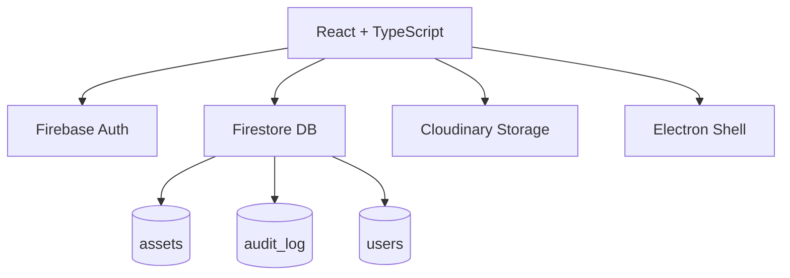

<div align="center">

# 📦 OmniTrace ERP

**Sistema empresarial de trazabilidad y gestión de activos médicos**  
Desde la solicitud hasta el despacho final — cada movimiento registrado.

[](https://github.com/SOQI17/OmniTrace/releases)
[](https://react.dev)
[](https://www.typescriptlang.org)
[](https://firebase.google.com)
[](https://www.electronjs.org)
[](LICENSE)

</div>

---

## ¿Qué es OmniTrace?

OmniTrace es un ERP interno para la gestión completa del ciclo de vida de activos médicos e industriales. Centraliza el flujo de trabajo desde la solicitud de compra hasta la entrega en sitio, con trazabilidad completa, auditoría en tiempo real y generación de documentos.

**Disponible como:** aplicación web (navegador) y aplicación de escritorio (Windows via Electron).

---

## ✨ Funcionalidades Principales

| Módulo | Descripción |
|--------|-------------|
| **Dashboard** | KPIs en tiempo real, gráficas de estado y actividad reciente |
| **Solicitudes** | Crear y gestionar órdenes de compra y préstamo de herramientas |
| **Logística** | Tracking de importaciones, liquidación aduanal, costos CIF |
| **Bodega** | Recepción, ubicación QR, despacho e inventario |
| **Documentos** | Gestión de expedientes con adjuntos en Cloudinary |
| **Retornos** | Garantías, DOA y préstamos activos |
| **Auditoría** | Historial completo e inmutable de cada cambio |
| **Administración** | Gestión de usuarios, roles y permisos granulares |

---

## 👥 Roles y Permisos

| Rol | Descripción | Módulos accesibles |
|-----|-------------|-------------------|
| `REQUESTER` | Solicitante | Solicitudes |
| `IMPORTER` | Logística / Aduana | Solicitudes, Logística, Documentos, Retornos |
| `WAREHOUSE` | Bodeguero | Bodega, Documentos, Retornos |
| `ADMIN` | Administrador | Todo + Gestión de usuarios |

> Los roles se gestionan desde Firestore (`users/{uid}`) y se administran desde el panel de Administración de la app.

---

## 🏗️ Arquitectura



### Stack Tecnológico

| Capa | Tecnología |
|------|-----------|
| UI | React 18 + TypeScript |
| Estado | React Hooks (useState, useEffect, useMemo) |
| Base de datos | Firebase Firestore (tiempo real) |
| Autenticación | Firebase Auth (email/password) |
| Archivos | Cloudinary (PDFs, imágenes) |
| Gráficas | Recharts |
| PDF | jsPDF |
| QR | qrcode.react |
| Excel | SheetJS (xlsx) |
| Desktop | Electron 29 |
| Build | Vite 5 |

---

## 🚀 Instalación Local (Web)

### Prerrequisitos
- Node.js 18+
- Una cuenta de [Firebase](https://firebase.google.com) con Firestore y Auth habilitados
- Una cuenta de [Cloudinary](https://cloudinary.com) (plan gratuito disponible)

### Pasos

```bash
# 1. Clonar el repositorio
git clone https://github.com/SOQI17/OmniTrace.git
cd OmniTrace

# 2. Instalar dependencias
npm install

# 3. Configurar variables de entorno
cp .env.example .env.local
# Edita .env.local con tus credenciales de Firebase y Cloudinary

# 4. Iniciar en modo desarrollo
npm run dev
```

La app estará disponible en `http://localhost:5173`

---

## 🖥️ Aplicación de Escritorio (Electron)

```bash
# Desarrollo con recarga en caliente
npm run electron:dev

# Compilar instalador .exe para Windows
npm run electron:build
```

El instalador se genera en `dist-electron/`.

---

## 🔐 Variables de Entorno

Copia `.env.example` como `.env.local` y completa los valores:

```env
# Firebase
VITE_FIREBASE_API_KEY=
VITE_FIREBASE_AUTH_DOMAIN=
VITE_FIREBASE_PROJECT_ID=
VITE_FIREBASE_STORAGE_BUCKET=
VITE_FIREBASE_MESSAGING_SENDER_ID=
VITE_FIREBASE_APP_ID=

# Cloudinary
VITE_CLOUDINARY_CLOUD_NAME=
VITE_CLOUDINARY_UPLOAD_PRESET=
```

> **Nunca** subas `.env.local` al repositorio. Está incluido en `.gitignore`.

---

## 📐 Estructura del Proyecto

```
omnitrace/
├── components/          # Componentes React reutilizables
│   ├── ErrorBoundary.tsx
│   ├── LoginScreen.tsx
│   ├── AssetLabelPDF.tsx
│   ├── AuditLogViewer.tsx
│   └── Header.tsx
├── services/            # Lógica de negocio
│   └── AssetLifecycleService.ts
├── electron/            # Proceso principal de Electron
│   └── main.js
├── public/              # Assets estáticos
├── App.tsx              # Componente raíz y lógica principal
├── types.ts             # Tipos TypeScript globales
├── firebase.ts          # Configuración de Firebase
└── firestore.rules      # Reglas de seguridad de Firestore
```

---

## 🔒 Seguridad

- **Autenticación** obligatoria para acceder a cualquier dato
- **Roles basados en Firestore** — los permisos se leen en tiempo real
- **Audit log inmutable** — ningún usuario puede editar o borrar el historial
- **Reglas de Firestore** — validación en el servidor, no solo en el cliente
- **Variables de entorno** — ninguna credencial en el código fuente

---

## 📄 Licencia

MIT © 2026 ORIB — [SOQI17](https://github.com/SOQI17)
